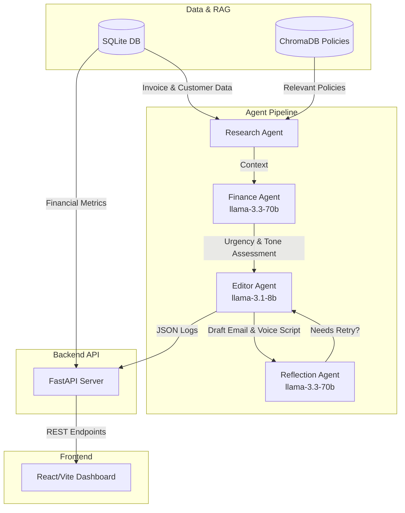

# FinFlow AI: AR Collections Automation

FinFlow AI is a hierarchical, multi-agent AI system designed to automate Accounts Receivable (AR) collections and surface actionable financial insights. Built as a portfolio project for a Forward Deployed Engineer role, it demonstrates expertise in agent orchestration, Retrieval-Augmented Generation (RAG) for strict policy adherence, multi-model LLM usage, and modern full-stack development.

## System Architecture



## The Problem
Accounts Receivable teams often struggle with chronic late payments that severely impact cash flow. Manual collections outreach is unscalable and resource-intensive, while rigid automated dunning emails are easily ignored and fail to account for a customer’s unique payment history or nuanced company policies.

## What I Built
I engineered an end-to-end multi-agent orchestration pipeline backed by a SQL database, served via a FastAPI REST backend, and visualized through a modern React dashboard.
- **[RAG Knowledge Base](file:///c:/Users/Suraj/Desktop/FinFlow_Ai/finflow-ai/rag/):** Uses `sentence-transformers` and ChromaDB to ingest company policies, ensuring agents ground their drafts in real late-fee rules and payment terms.
- **[Research Agent](file:///c:/Users/Suraj/Desktop/FinFlow_Ai/finflow-ai/agents/research_agent.py):** Fetches overdue invoices, historical payment data, and dynamically retrieves relevant policy chunks based on days overdue.
- **[Finance Agent](file:///c:/Users/Suraj/Desktop/FinFlow_Ai/finflow-ai/agents/finance_agent.py):** Acts as the decision-maker. Uses Groq's `llama-3.3-70b-versatile` model to score invoice urgency and dictate the communication tone (gentle, firm, or escalation).
- **[Editor & Reflection Agents](file:///c:/Users/Suraj/Desktop/FinFlow_Ai/finflow-ai/agents/editor_agent.py):** The Editor uses a faster LLM to draft both an email and a TTS-compliant voice script. The Reflection Agent critiques the draft against the retrieved policies, triggering an automated retry loop if groundedness or tone scores fall below a threshold.
- **[Backend API](file:///c:/Users/Suraj/Desktop/FinFlow_Ai/finflow-ai/api/server.py):** A robust FastAPI layer that securely queries the SQLite database and exposes the agent orchestration pipeline.
- **[React Dashboard](file:///c:/Users/Suraj/Desktop/FinFlow_Ai/finflow-ai/frontend/src/App.jsx):** A premium, glassmorphism-styled Vite React application built with TailwindCSS and Recharts that consumes the FastAPI endpoints to visualize DSO trends and agent-drafted logs.

## Process Improvement Finding
Through the analytics dashboard, the mock data revealed a critical operational bottleneck: 
> **Finding:** Customers in the *unreliable* tier account for a disproportionate amount of total overdue value, yet they historically receive follow-ups purely based on standard due-date timelines (the exact same baseline as reliable customers). 
> **Recommendation:** Outreach orchestration should proactively prioritize accounts based on *risk tier*, rather than reacting purely based on days overdue.

## What I'd Do In Production
To scale this proof-of-concept into a resilient, enterprise-grade application, I would implement:
- **LiveKit + Twilio SIP Trunking:** Transition the one-off MP3 voice script into a real-time conversational AI loop using low-latency WebSockets (e.g., Deepgram STT, Cartesia TTS) and Voice Activity Detection (VAD) for real-time interruption handling.
- **Human-in-the-Loop (HITL):** Require a human AR specialist to approve, edit, or reject the AI-generated escalation drafts before they are dispatched via SendGrid or Twilio.
- **Multi-Tenant Data Isolation:** Shift from SQLite to PostgreSQL with Row-Level Security (RLS) to ensure customer data is strictly segregated across different client organizations.
- **Prompt A/B Testing Infrastructure:** Use an evaluation framework (like LangSmith or Braintrust) to A/B test prompt versions across different models to mathematically optimize conversion (payment) rates over time.

## How to Run It Locally

**1. Setup Python Backend**
```powershell
python -m venv venv
.\venv\Scripts\Activate.ps1
pip install -r requirements.txt
```

**2. Environment Variables**
Rename `.env.example` to `.env` and add your Groq API key:
```env
GROQ_API_KEY=your_actual_key_here
```

**3. Start FastAPI Server**
```powershell
uvicorn api.server:app --reload
```

**4. Start React Frontend**
In a separate terminal, navigate to the frontend directory:
```powershell
cd frontend
npm install
npm run dev
```

**5. View Dashboard**
Open `http://localhost:5173` in your browser!
